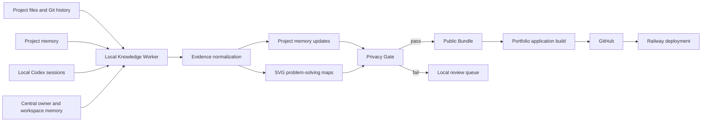

# Dowon Project Atlas Design

- Date: 2026-08-24
- Status: Approved architecture, pending implementation-plan approval
- Service repository: `/home/dowon/securedir/git/codex/portfolio-homepage`
- Working product name: **Dowon Project Atlas**

## 1. Purpose

Unify the existing portfolio homepage and `projects/llm_wiki` into one always-on service that discovers projects, preserves useful project history, and updates its public pages without manual duplication.

The system must:

1. Treat each actual project directory as an independent project, including every child of `projects/finish/`.
2. Build project pages from current source files, curated project memory, and locally available Codex session history.
3. Record difficult parts of the work, especially repeated revisions, competing drafts, test failures, and rollbacks.
4. Maintain project-specific problem-solving diagrams as SVG files.
5. Reuse the existing knowledge graph interaction model while replacing its noisy tag and edge generation.
6. Publish only a sanitized public bundle. Raw sessions and private memory must never leave the local machine.
7. Update incrementally and deploy through the existing GitHub-to-Railway path.

## 2. Non-Goals

- Expose raw Codex conversations or add a public Sessions tab.
- Treat `projects/finish/` as one project.
- Upload API keys, credentials, private data, raw logs, absolute local paths, or reversible encrypted copies of private values.
- Depend on `AGENTS.md` alone as an executable automation system.
- Copy the full central memory into every project.
- Convert every loose file under `projects/` into a project automatically.
- Delete the existing `projects/llm_wiki` output before feature parity is verified.

## 3. Core Decisions

### 3.1 One service, one publication repository

`portfolio-homepage` remains the deployable Git repository. The useful content and graph features from `projects/llm_wiki` move into this service. The old wiki remains read-only reference material until the new service passes parity checks, then moves to legacy status.

### 3.2 Local-first knowledge processing

All sensitive discovery, session parsing, inference, and redaction happen inside the Codex workspace. Railway receives only generated public artifacts and application code.

### 3.3 Three-layer source precedence

When multiple sources disagree, use this order:

1. Explicit manual override in a project profile.
2. Curated project memory maintained during project work.
3. Inferred facts from source files, Git history, and local Codex sessions.

Current source code and explicit project status always constrain historical inference. A session statement cannot override what the project currently contains unless it is presented as historical context.

### 3.4 Instruction plus worker, not instruction alone

`AGENTS.md` defines when and what to remember. A local knowledge worker performs reliable discovery, backfill, validation, generation, and publishing. A user-level timer catches updates missed at the end of a Codex session.

## 4. System Architecture



The external boundary starts at the public bundle. No upstream material is considered publishable by default.

## 5. Filesystem Model

### 5.1 Workspace-level files

```text
codex/
├── AGENTS.md
├── dowon_manager_agent_brief.md
├── central_memory/
│   ├── adapters/AGENTS.md
│   ├── active_projects.md
│   ├── project_agent_inventory.md
│   ├── owner_profile.md
│   ├── global_working_rules.md
│   └── skill_registry.md
├── .knowledge-worker/                 # local-only runtime state
│   ├── config.yaml
│   ├── project-aliases.yaml
│   ├── session-cursor.json
│   ├── provenance/
│   ├── review-queue/
│   └── last-good-manifest.json
├── projects/
│   ├── <active-project>/
│   └── finish/
│       └── <finished-project>/
└── portfolio-homepage/                # deployable service repository
```

`.knowledge-worker/` contains no public content. Session summaries retain source references and confidence locally so inferred facts can be audited without exposing those references.

Outside the workspace, `~/.codex/AGENTS.md` remains the canonical user-wide instruction entry point and `~/.codex/memories/` remains Codex's own selective user-wide memory store. The worker does not hand-edit Codex-generated memory state.

### 5.2 Project memory contract

Each recognized project may contain:

```text
project_memory/
├── project-profile.yaml
├── build-story.md
├── decisions.md
├── rollbacks.md
└── visuals/
    └── problem-solving.svg
```

`project-profile.yaml` is the stable identity and publication contract. It contains:

- stable project ID and display name
- lifecycle status
- publication state: `public`, `private`, or `excluded`
- directory and historical path aliases
- short summary and outcome
- tag overrides and rejected tags
- source-of-truth file pointers
- optional repository and live-service links

The Markdown and SVG files are created only when evidence exists. Empty template files are not generated. Existing `manager_memory/` or project-specific memory remains readable during migration, but new durable project history converges on `project_memory/`.

### 5.3 Public bundle contract

The application consumes generated files under the service repository:

```text
public-bundle/
├── manifest.json
├── projects/
│   └── <project-id>/
│       ├── project.json
│       ├── build-story.md
│       ├── decisions.md
│       ├── rollbacks.md
│       └── visuals/problem-solving.svg
├── graph/
│   ├── nodes.json
│   └── edges.json
├── topics.json
├── changelog.json
└── search-index.json
```

This directory is rebuilt from an empty staging directory and promoted atomically after all checks pass. It never receives direct copies of raw session files or unrestricted memory directories.

## 6. Project Discovery

The discovery rules are deterministic:

1. Each eligible direct child of `projects/` is a project.
2. `projects/finish/` is a status container; each eligible direct child is a separate finished project.
3. Infrastructure and generated-output directories are excluded by configuration, including hidden directories, caches, `scripts`, `docs`, `tests`, `tmp`, `legacy`, and the old generated `llm_wiki` site.
4. A valid `project-profile.yaml` overrides automatic classification.
5. Nested repositories belong to the nearest configured parent project unless their own profile declares an independent project ID.
6. Standalone notebooks or files are published only when explicitly registered in the workspace project index.

Discovery writes a machine-readable report containing added, moved, renamed, excluded, and ambiguous candidates. Ambiguous candidates enter the local review queue and do not publish automatically.

## 7. Historical Session Backfill

Local Codex session history is an analysis source, not a publication source.

### 7.1 Session-to-project mapping

Sessions map to projects using:

1. Recorded session working directory.
2. Current project path.
3. Historical aliases from `.knowledge-worker/project-aliases.yaml`.
4. Referenced file paths and repository remotes when the working directory is stale.

Unmapped sessions remain ignored until a mapping is added. The worker records session checksums and cursors so unchanged files are not processed again.

### 7.2 Signals worth extracting

The worker selects evidence rather than storing every interaction. High-value signals include:

- repeated edits to the same behavior or visual component
- multiple requested drafts or competing implementation directions
- explicit user corrections and changed requirements
- failed tests, production incidents, and recovered defects
- rollback commands or language indicating a return to an earlier design
- architecture decisions with meaningful alternatives or tradeoffs
- unusually broad patches or long multi-stage sessions

### 7.3 Extraction and verification

For each candidate signal, the worker:

1. Produces a local structured claim with project ID, event date, claim type, evidence references, and confidence.
2. Cross-checks the claim against current source, project docs, and Git history where available.
3. Merges high-confidence facts into project memory without duplicating existing entries.
4. Sends conflicting or low-confidence claims to the local review queue.
5. Removes raw prompt and response text from generated public output.

Deleted sessions, remote-only history, and unavailable accounts cannot be recovered; backfill completeness is limited to locally retained evidence.

## 8. Ongoing Memory Updates

### 8.1 Root AGENTS rule

The always-on entry point is `~/.codex/AGENTS.md`. It applies even when Codex starts inside an independent Git repository under `projects/`, and it directs Codex to the canonical owner brief and workspace adapter. It is the single source for user-wide memory routing and the meaningful-work checkpoint rule.

The workspace `codex/AGENTS.md` adds only workspace-specific project indexing, file locations, and creation policy. It does not duplicate the global memory rule. Project files remain local deltas only. Updating the global file is a one-time operation outside the workspace sandbox and therefore uses an explicit permission request during implementation.

A checkpoint is warranted when a durable decision, hard-won resolution, significant change in direction, repeated revision, rollback, or owner preference has emerged.

The rule will state:

- Update the current project's `project_memory/` for project-specific facts.
- Update `/home/dowon/securedir/git/codex/dowon_manager_agent_brief.md` only for stable owner traits, preferences, collaboration patterns, or decision tendencies that apply across projects.
- Do not log routine commands, transient exploration, or low-value conversational detail.
- Regenerate the problem-solving SVG when a recorded challenge changes the project's decision path.
- Never place secrets or private raw data in publishable memory.

### 8.2 Project-level AGENTS rule

A project-level `AGENTS.md` is not generated for every directory. It is created or updated only under the existing root policy: explicit user request, new project initialization, material local rule differences, or stale-rule cleanup.

When present, it points to the project's memory contract and contains only local deltas. It does not duplicate the root memory policy or owner brief.

### 8.3 Timer fallback

A user-level systemd timer runs the knowledge worker periodically and on login. It detects changed projects and unprocessed sessions, then performs an incremental dry run, privacy validation, and publication update. The worker can also be called manually from the service repository.

### 8.4 Skill routing

The global instruction entry point will require a Superpowers preflight for non-trivial planning, design, implementation, debugging, and review work. The matching Superpowers workflow runs before specialist or implementation work. Direct factual answers and trivial terminal lookups remain lightweight. Broad multi-role work continues to use `multi-agent-manager-ko` as coordinator after the Superpowers preflight; narrow tasks invoke the smallest relevant specialist.

## 9. Privacy and Publication Boundary

### 9.1 Publication states

- `public`: eligible for sanitized publication.
- `private`: retained locally and omitted completely from public output.
- `excluded`: ignored by the service, including generated or operational directories.

New ambiguous projects default to `private` until classified. This is fail-closed behavior.

### 9.2 Content controls

The privacy gate combines:

- source denylist for `.env`, credentials, private datasets, raw logs, caches, and session files
- field allowlist for the public project schema
- secret-pattern scanning
- personal identifier, internal URL, IP address, email, phone, and absolute-path scanning
- Markdown, HTML, SVG, JSON, and search-index inspection
- source-map and HTML-comment exclusion

### 9.3 Irreversible masking

Private content is omitted whenever possible. When a stable public alias is necessary, the worker uses a keyed HMAC alias such as `CLIENT_7F31`; the key remains local and is never committed or deployed. When stable linkage is unnecessary, the value becomes `[REDACTED]`.

Reversible encryption is not used for public masking because encrypted source values could later be decrypted. Public artifacts contain only the alias or deletion marker.

### 9.4 Failure behavior

Any unresolved privacy finding blocks bundle promotion and deployment. The current production bundle remains unchanged, and a local report identifies the project, output field, and detector category without copying the sensitive value into logs.

## 10. Tag and Graph Model

The existing graph presentation and interaction patterns are retained, but the graph data is rebuilt from explicit project semantics.

### 10.1 Tag taxonomy

Each project may publish:

- Domain: 1-2 tags
- Problem: 1-3 tags
- Pattern: 1-3 tags
- Technology: inferred from manifests and source, with manual correction
- Outcome: 1-2 tags describing the delivered artifact or measurable result

An inferred semantic tag requires support from at least two source classes among project memory, key code/docs, and verified session summary. Manual profile overrides may approve or reject a tag explicitly.

### 10.2 Graph relationships

Primary graph edges are typed:

- Project -> Domain
- Project -> Problem
- Project -> Pattern
- Project -> Technology
- Project -> Outcome

Project-to-project similarity edges are derived from shared high-signal tags. Only the strongest five neighbors per project are published, with deterministic tie-breaking. Generic technologies receive lower weights than shared problems or patterns. This prevents the broad keyword matching and pair explosion in the current generated graph.

### 10.3 SVG problem-solving maps

Each project map visualizes a compact sequence:

```text
Initial constraint -> Attempt or option -> Failure/revision -> Decision -> Result
```

The SVG uses a shared accessible style system but project-specific content. It includes a title, text alternatives, stable node IDs, responsive `viewBox`, light/dark tokens, and no embedded script or external resource. The privacy gate scans all SVG text and metadata.

## 11. Product Experience

### 11.1 Information architecture

Primary navigation:

- Home
- Projects
- Topics
- Graph
- Changelog
- Search

Project detail tabs:

- Overview
- Build Story
- Decisions
- Rollbacks
- Visual Map
- Artifacts

Tabs are appropriate because the collection contains many independent projects rather than one deep linear documentation tree. Deep links preserve the selected project and tab.

### 11.2 Visual and interaction requirements

The implementation will retain the strongest qualities of the referenced LLM Wiki while fitting the existing portfolio identity:

- fixed global navigation and visible reading progress
- Inter for interface/body text and JetBrains Mono for technical metadata
- `letter-spacing: 0`
- 40-44 px minimum icon and compact action targets
- light/dark theme prepaint to prevent theme flash
- command search with `Cmd/Ctrl+K`
- mobile menu and compact bottom navigation
- project previous/next navigation
- anchored table of contents for long project narratives
- responsive SVG and graph canvases
- stable control dimensions and no overlapping text at supported widths

The first screen is the working project explorer, not a marketing landing page. The current graph interactions are reused where they remain useful, including filtering, focus, zoom, and fit-to-view.

### 11.3 Content rendering

Manual CMS fields remain supported as overrides. Generated project content forms the base. Rendering order is:

1. Generated sanitized project record.
2. Curated content from project memory.
3. Manual public override from the existing CMS.

An override never reintroduces a field rejected by the privacy gate.

## 12. Incremental Build and Deployment

The worker computes content hashes for source manifests, memory files, session cursors, generated SVGs, graph records, and search documents.

On each run:

1. Discover project changes and moved paths.
2. Process only changed evidence.
3. Update affected project memory and visual maps.
4. Rebuild affected public project artifacts.
5. Recalculate only graph neighborhoods and search entries impacted by changed tags.
6. Run full-bundle privacy and schema checks.
7. Compare the candidate manifest with the last good manifest.
8. Commit and push only when the public bundle has a meaningful diff.
9. Let the existing GitHub integration trigger Railway deployment.
10. Verify the deployed health endpoint and public manifest version.

A no-op run creates no commit. Deployment credentials remain in the existing local or platform credential stores and never enter generated content.

## 13. Failure Recovery

- Discovery failure: keep the last good project index and publish nothing.
- Invalid project profile: quarantine that project update and report a local validation error.
- Session parse failure: skip the damaged session, record its checksum and error locally, and continue unrelated projects.
- SVG generation failure: retain the last valid SVG and block that project's new bundle version.
- Privacy failure: block the entire publish operation.
- Build or test failure: retain the last good bundle and do not commit.
- Git push or Railway failure: keep the validated local bundle, report the failed stage, and leave production unchanged.

All stages are rerunnable and use atomic staging so interrupted work does not corrupt the last good state.

## 14. Migration Sequence

1. Inventory current projects, project-local memories, existing graph data, and generated wiki artifacts.
2. Implement and validate the project profile, memory, public bundle, and provenance schemas.
3. Implement the privacy gate before any session-derived content can publish.
4. Replace the current project scanner with deterministic active/finished discovery.
5. Port the existing graph renderer and SVG assets into the service with the new taxonomy.
6. Build the unified tab-based UI and migrate existing CMS overrides.
7. Run historical session backfill locally in dry-run mode, inspect conflicts, then approve sanitized project memory updates.
8. Enable incremental generation and the systemd timer.
9. Cut Railway over to the unified service and run production checks.
10. Mark the old `projects/llm_wiki` output as legacy only after content, graph, search, and responsive parity pass.

## 15. Verification and Acceptance Criteria

### Discovery and memory

- Every eligible active project is discovered.
- Every eligible child of `projects/finish/` is listed independently.
- No aggregate `finish` project exists.
- Moved projects retain stable IDs through aliases.
- A no-op worker run changes no generated file and creates no Git commit.
- Meaningful new decisions update project memory; routine conversation does not.
- Stable cross-project owner preferences update the root `dowon_manager_agent_brief.md` without project-specific leakage.

### Privacy

- Secret, personal-data, internal-path, and raw-session fixtures are rejected.
- No public artifact contains `/home/dowon`, session JSONL text, local provenance references, HMAC keys, source maps, or hidden HTML comments.
- HMAC aliases are deterministic with the local key and cannot reveal the original value from public output.
- A privacy failure leaves the deployed version unchanged.

### Graph and tags

- Domain, Problem, Pattern, and Outcome limits are enforced.
- Inferred semantic tags retain two-source evidence locally.
- Each project publishes at most five project-similarity neighbors.
- Graph filtering, focus, zoom, and fit-to-view work with the regenerated data.
- Existing useful project relationships remain representable without publishing thousands of low-signal edges.

### User interface

- Project tabs, deep links, search, reading progress, previous/next navigation, light/dark mode, and mobile navigation work.
- Playwright screenshots pass at representative desktop and mobile viewports.
- Canvas or SVG pixel checks confirm the graph is nonblank and correctly framed.
- Text and controls do not overlap or resize unexpectedly.
- Keyboard and screen-reader navigation cover tabs, search, graph controls, and SVG alternatives.

### Deployment

- Application tests and bundle schema checks pass.
- `/api/health` succeeds locally and on Railway.
- A public bundle commit triggers deployment.
- The deployed manifest version matches the pushed commit.
- The last good production version remains available after simulated worker, build, push, and deploy failures.

## 16. Implementation Boundaries

The first implementation keeps the current `portfolio-homepage` repository, Node server, Railway service, and useful CMS behavior. It changes discovery, content generation, privacy enforcement, information architecture, and graph data. It does not introduce a separate hosted database for raw knowledge or a second production service.

The exact implementation tasks, file-level changes, test order, and rollout checkpoints will be defined in a separate implementation plan after this design is reviewed.
