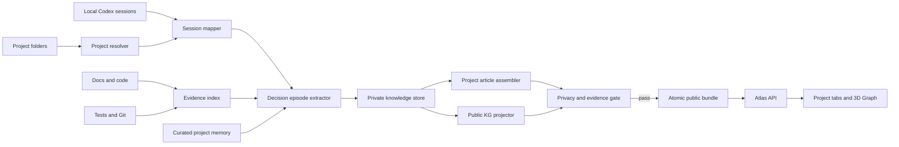

# Project Atlas 콘텐츠 및 Graph 재설계 명세

- 작성일: 2026-08-27
- 상태: 설계 승인, 구현 계획 작성 완료
- 대상 저장소: `/home/dowon/securedir/git/codex/portfolio-homepage`
- 기준 작업 브랜치: `feature/project-atlas-public-experience`
- 선행 명세: `docs/superpowers/specs/2026-08-24-project-atlas-design.md`

이 문서는 선행 명세의 프로젝트 발견·공개 경계·Railway 배포 원칙은 유지하고,
프로젝트 콘텐츠, 세션 추출, Graph 데이터, Graph UI, 프로젝트 상세 UI를
대체한다. 충돌 시 이 문서가 우선한다.

## 1. 목표

Project Atlas를 폴더 목록과 태그 그래프가 아니라 다음 두 경험으로 바꾼다.

1. 각 프로젝트를 처음 보는 사람이 기획 배경부터 구현·검증 결과까지 이해할
   수 있는 Decision 중심 설명 글
2. 기존 `llm_wiki`의 3D 탐색 경험을 살리면서 전체 노드를 한꺼번에 보여주지
   않는 전역 Knowledge Graph

Project Atlas는 예시 프로젝트 몇 개만 잘 보이는 데모가 아니라, 공개 대상으로
분류된 모든 프로젝트를 동일한 근거 수집 절차로 분석해야 한다. 다만 글의 길이,
문제 수, 결정 수, SVG 수는 프로젝트마다 달라도 된다.

## 2. 승인된 핵심 원칙

### 2.1 프로젝트는 절대 자동 병합하지 않는다

- `projects/` 아래에서 독립 프로젝트로 발견된 폴더는 각자 별도 ID와 별도
  상세 페이지를 유지한다.
- `projects/finish/`는 상태 컨테이너일 뿐이며, 그 아래 각 폴더가 독립
  프로젝트다.
- 이름이 비슷하거나 버전 표기가 있다는 이유만으로 `ProjectFamily`를 만들거나
  프로젝트를 하나의 페이지로 합치지 않는다.
- 이전 버전, 선행 프로젝트, 후속 브랜치가 근거로 확인되면 현재 프로젝트 글의
  배경 설명과 링크로만 기록한다.
- 연결 근거가 없으면 이전 이력이나 프로젝트 관계를 만들지 않는다.
- Git worktree는 기본적으로 소유 저장소의 구현 근거다. 별도
  `project-profile.yaml`이 독립 ID를 선언한 경우에만 별도 프로젝트가 된다.

예를 들어 `260802_map_diary_v2`는 독립 페이지다. 해당 글은 V1의 수동 도로
기록에서 어떤 요구가 남아 V2의 경로 주행 기능으로 이어졌는지 설명할 수 있지만,
V1과 V2를 하나의 프로젝트로 병합하지 않는다.

### 2.2 확인된 문제는 모두 기록하고 빈 항목은 만들지 않는다

- 문제·결정·대안·롤백·수정 횟수에 상한이나 목표 개수를 두지 않는다.
- 로컬에 남아 있는 세션, 문서, 코드, 테스트, Git 근거에서 확인된 material
  issue는 모두 기록 후보가 된다.
- 문제가 없거나 대안을 검토하지 않은 작업에는 문제나 대안 항목을 억지로
  생성하지 않는다.
- 동일한 결정의 반복 논의를 여러 결정으로 부풀리지 않는다.
- 절대적 완전성을 주장하지 않는다. 공개 글의 범위는 로컬에 남아 있고 현재
  분석 가능한 근거까지다.

### 2.3 기획 결정이 설명의 중심이다

글은 기술 난이도만 나열하지 않는다. 가능한 경우 다음 순서로 설명한다.

1. 사용자 문제와 제품 목표
2. 해당 버전·단계에서 범위를 정한 이유
3. 운영·정책·데이터·UX 제약
4. 검토한 대안과 변경된 요구
5. 선택한 결정과 포기한 것
6. 결정을 구현한 기술 구조
7. 테스트·수치·사용 결과와 남은 한계

이 순서는 서술 우선순위이며 고정 템플릿이 아니다. 근거가 없는 절은 렌더링하지
않는다. 기획 설명과 기술 설명의 글자 수 비율도 강제하지 않는다.

### 2.4 설명은 글이 담당하고 SVG는 보조한다

- 프로젝트 설명의 정본은 장문 Markdown 글이다.
- SVG는 본문에서 설명하기 어려운 특정 구조, 상태 전이, 데이터 수명, 선택지
  차이를 보조한다.
- 프로젝트 전체를 `문제 -> 결정 -> 결과` 몇 개 노드로 축약한 generic SVG를
  만들지 않는다.
- 시각화할 내용이 없으면 SVG를 생성하지 않는다.
- 프로젝트별 SVG 수를 맞추지 않는다.

### 2.5 제목은 담백하게 작성한다

권장 제목:

- `TMAP 데이터 장기 저장 제한 해결`
- `백그라운드 위치 기록 개선`
- `미확정 도로 구간 수정 기능`
- `검토 대기함의 세션 분리`

금지하는 스타일:

- 과장된 서사형 제목
- 감정적 수사와 의인화
- 본문보다 큰 결론을 암시하는 제목
- 근거 없는 성공 표현

`화면은 웹에 남기고 기록은 네이티브로 옮겼다`처럼 결정 내용을 직접 설명하는
평서형 제목은 허용한다.

## 3. 현재 구현의 문제

### 3.1 프로젝트 콘텐츠

- `PublicProject.decisions`가 구조화된 기록이 아니라 문자열 tuple이다.
- `## Decisions` 아래의 한 줄 목록만 읽고 하위 맥락·대안·검증 근거를 버린다.
- 세션 backfill은 `failure resolved`, `rollback requested` 같은 라벨만 남기고
  실제 논의 내용을 보존하지 않는다.
- Overview는 summary, outcome, tags를 반복한다.
- Visual Map은 프로젝트마다 거의 동일한 2노드 구조라 설명 가치가 없다.

### 3.2 전역 Graph

- 현재 공개 데이터는 33개 프로젝트와 241개 태그를 포함해 274개 노드와
  393개 edge를 만든다.
- 프로젝트 유사도는 공유 태그 가중치로 생성되며, 의미 없는 공통 기술만으로도
  프로젝트 사이에 선이 생긴다.
- `client/graph-view.js`는 프로젝트를 2열 grid, 태그를 상하 band에 배치하며
  관계가 좌표를 결정하지 않는다.
- 선택 동작은 카메라 이동 중심이고, 선택한 관계의 근거나 주변 subgraph를
  읽기 쉽게 분리하지 않는다.
- 사용자가 재사용을 요청한 `projects/llm_wiki/site/index.html`의 3D 회전·줌·
  drag·관계 필터 경험이 현재 Atlas에 이식되지 않았다.

## 4. 시스템 경계



원문 세션, 절대 경로, 내부 provenance, 비공개 파일은 private zone을 벗어나지
않는다. 공개 서비스는 검증된 article, inline SVG, project metadata, public KG
projection만 읽는다.

## 5. 프로젝트 식별과 이전 이력

### 5.1 프로젝트 식별

선행 명세의 project discovery 규칙을 유지한다. 추가로 다음을 금지한다.

- filename similarity만으로 프로젝트 관계 생성
- `_v2`, `_v3` suffix만으로 병합
- 같은 Git remote만으로 병합
- worktree를 자동 프로젝트로 공개

### 5.2 이전 이력 기록 조건

현재 프로젝트 글에 이전 이력을 쓰려면 아래 중 하나 이상의 직접 근거가 있어야
한다.

- 현재 프로젝트 문서가 선행 버전이나 이전 저장소를 명시
- Git history 또는 worktree metadata가 명확한 ancestry를 제공
- 세션에서 사용자가 선행 버전과 현재 요구의 차이를 명시
- curated project memory가 승인된 predecessor를 선언

이전 이력은 현재 프로젝트의 `prior_context`로 저장한다. 이전 프로젝트의 본문을
복사하지 않고, 현재 단계가 필요해진 이유만 요약하고 원문 프로젝트 링크를
제공한다.

## 6. 콘텐츠 데이터 모델

### 6.1 Project article

프로젝트별 공개 콘텐츠는 다음 논리 구조를 사용한다.

```yaml
project_id: string
title: string
summary: string
prior_context: optional markdown
sections:
  - id: stable-string
    title: neutral Korean title
    section_type: planning | decision | implementation | validation | result
    body: markdown
    evidence_ids: [string]
    diagrams: [public-svg-path]
decision_index:
  - decision_id: string
    section_id: string
    status: adopted | revised | rolled-back | unresolved
    evidence_ids: [string]
```

`sections`와 `decision_index` 길이는 제한하지 않는다. `prior_context`,
`diagrams`, `decision_index`는 근거가 없으면 빈 UI를 만들지 않고 생략한다.

### 6.2 Decision episode

세션·문서·코드에서 수집한 하나의 의사결정 흐름은 private store에서 다음 선택
필드를 가진다.

```yaml
decision_id: string
project_id: string
problem: optional markdown
product_goal: optional markdown
constraints: [markdown]
options: [markdown]
choice: optional markdown
implementation: optional markdown
validation: optional markdown
result: optional markdown
status: candidate | supported | contradicted | superseded
evidence_ids: [string]
```

모든 field를 채우는 것이 목표가 아니다. `choice`나 `result`가 없으면 결정으로
확정하지 않고 문제·시도·미해결 항목으로 남길 수 있다.

### 6.3 Evidence

```yaml
evidence_id: string
project_id: string
source_type: session | spec | code | test | git | project_memory
source_locator: private-only
observed_at: timestamp
claim_role: supports | contradicts | supersedes
privacy_class: public-safe | private | secret
content_hash: string
```

공개 article에는 evidence의 안전한 문서명·커밋·테스트 수치만 projection한다.
로컬 session path와 원문 line은 공개하지 않는다.

## 7. 전체 프로젝트 콘텐츠 생성

### 7.1 초기 backfill

현재 공개 대상 프로젝트 전체에 대해 다음 순서로 실행한다.

1. 프로젝트별 source manifest 작성
2. README, docs, specs, plans, decisions, worklogs, tests, package metadata,
   source entrypoint, Git history 조사
3. `cwd` 외에 `git-common-dir`, 변경 파일, parent thread를 사용한 세션 매핑
4. 하위 Agent 세션을 별도 프로젝트 결정으로 세지 않고 부모 결정의 구현·QA
   근거로 병합
5. 사용자 요구, 수정 요청, 승인, 구현, 테스트, rollback을 Decision Episode로
   묶기
6. 기획·UX·운영 결정을 먼저 설명하고 기술 근거 연결
7. 프로젝트별 장문 article 및 필요한 inline SVG 생성
8. privacy, evidence, title-style, broken-link 검사
9. 프로젝트별 content audit report 생성
10. 모든 공개 프로젝트가 `ready` 또는 명시적 `insufficient-evidence` 상태인지
    확인 후 bundle promotion

`insufficient-evidence`는 generic 세 문장으로 칸을 채우는 상태가 아니다. 현재
확인 가능한 기능과 산출물만 설명하고, 문제·결정 절은 생성하지 않는다.

### 7.2 예시는 acceptance fixture이지 콘텐츠 범위가 아니다

Map Diary의 아래 사례는 extractor와 article 품질을 검증하는 fixture로 사용한다.

- V2: TMAP 데이터 24시간 초과 저장 제한
- V2: TMAP 경로를 세션 입력으로만 사용하고 VWorld Feature ID와 geometry
  snapshot을 영구 기록으로 보존
- V2: 영구 변환 뒤 TMAP 원본 경로를 방문 기록에 남기지 않음
- V3: Web UI와 native background recorder의 수명 분리
- V3: native SQLite를 GPS 원본 정본으로 사용
- V4 worktree evidence: 자동 확정하지 못한 gap에 기존 선 잇기 후보 생성과
  VWorld/ITS 검증 로직 재사용
- V4 worktree evidence: 자동 적용 대신 사용자 선택 후 확정

이 fixture가 통과해도 다른 프로젝트 article이 비어 있으면 전체 backfill은
완료가 아니다.

### 7.3 ongoing update

초기 backfill 뒤에는 다음 경계를 사용한다.

- Codex는 프로젝트 작업 중 material decision이 확정되면 해당 프로젝트의
  curated project memory를 선택적으로 갱신한다.
- worker는 변경된 project memory, docs, tests, Git, 새 session checksum을
  감지한다.
- 변경된 프로젝트만 article candidate와 KG projection을 다시 만든다.
- 새 session만으로 공개 prose를 무조건 덮어쓰지 않는다. 기존 근거와
  교차 확인하고 충돌하면 local review state에 둔다.
- validated candidate만 public bundle에 원자적으로 반영한다.
- 실패 시 마지막 정상 article과 bundle을 계속 제공한다.

worker는 background에서 외부 LLM, embedding API, vision API를 호출해 prose를
생성하지 않는다. 초기 장문 backfill은 현재 구현 작업에서 로컬 근거를 읽은
Codex가 curated article source로 작성한다. 이후에도 프로젝트 작업 중 Codex가
material decision을 curated project memory에 반영하고, worker는 그 검증된
Markdown을 조립·검사·배포한다. 별도의 unattended model 호출이 필요해지면
데이터 전송 범위, 비용, privacy를 다시 설계하고 사용자 승인을 받아야 한다.

## 8. 프로젝트 상세 UI

### 8.1 유지하는 UI

- Home, Projects, Topics, Graph, Changelog의 전역 navigation 구조
- 프로젝트 detail의 tab shell과 deep link
- light/dark mode, search, responsive navigation
- 기존 Atlas의 전체 레이아웃과 브랜드 표현

전체 서비스를 블로그 테마로 교체하지 않는다.

### 8.2 프로젝트 tabs

프로젝트 상세 tab은 다음 책임으로 정리한다.

- `Decisions`: 기본 진입. 장문 설명 글과 decision index
- `System Map`: 전체 시스템 구조와 주요 데이터 흐름
- `Build Timeline`: 날짜별 변경, rollback, release 흐름
- `Evidence`: 공개 가능한 spec, commit, test, artifact 링크

기존 Overview의 반복 summary/tag 영역은 제거한다. 프로젝트 제목 아래의 한 문장
summary와 metadata는 tab 밖 공통 header에 남긴다.

### 8.3 Decisions reader

- article 본문은 읽기 폭을 제한하되 outer Atlas shell은 유지한다.
- desktop의 왼쪽 목차는 `position: sticky`로 현재 article section을 따라간다.
- mobile은 목차를 compact menu로 제공하며 본문을 가리지 않는다.
- 상단 가로 progress bar는 sticky global/project header 바로 아래에 고정한다.
- progress 값은 전체 document가 아니라 현재 project article의 scroll progress다.
- section anchor와 deep link를 지원한다.
- article이 길어도 문제·결정을 삭제하지 않는다.
- 이전 이력이 있으면 현재 article의 짧은 `prior context` 절로 제공한다.
- 독립 프로젝트를 묶는 version tabs나 family page는 자동 생성하지 않는다.

### 8.4 Inline SVG

SVG는 해당 문단 바로 뒤에 배치하고 caption에서 무엇을 설명하는지 적는다.
허용하는 예:

- TMAP session input과 VWorld permanent record의 데이터 수명 차이
- Web UI, Capacitor, Swift recorder, SQLite의 책임 경계
- measured, inferred, unresolved 상태 전이
- rollback 전후의 UI flow 차이

모든 SVG는 responsive `viewBox`, text alternative, light/dark 색상, stable ID를
가진다. 외부 resource와 script를 포함하지 않는다.

## 9. 전역 Graph 재설계

### 9.1 역할

Graph tab은 프로젝트 본문을 대신해 설명하지 않는다. 사용자가 Focus, Domain,
Project, Tag, Technology, Artifact 사이의 연결을 탐색하고 프로젝트 글로 이동하는
별도 지식 탐색 도구다.

### 9.2 기존 llm_wiki 경험 복원

다음 경험은 `projects/llm_wiki/site/index.html`을 기준으로 복원한다.

- 3D 회전, zoom, pan, fit, reset
- node drag와 click focus
- Focus, Domain, Project, Tag, Technology, Artifact별 색상과 legend
- edge type filter
- 선택 node의 연결 정보 panel

당시의 수동 force simulation과 3D projection 코드는 그대로 복사하지 않는다.
`3d-force-graph`를 로컬 dependency로 사용한다. 이 라이브러리는 Three.js/WebGL과
검증된 3D force engine을 제공하며 orbit/trackball control, incremental graph
data, node/link interaction을 지원한다.

- 공식 문서: https://github.com/vasturiano/3d-force-graph
- Three.js WebGLRenderer: https://threejs.org/docs/pages/WebGLRenderer.html

CDN은 사용하지 않는다. `package-lock.json`으로 검증한 버전을 고정하고 기존
`npm run vendor` 흐름으로 client asset을 배포한다.

### 9.3 KG node와 edge

초기 public KG는 기존 llm_wiki의 의미 구조를 사용한다.

Node:

- KnowledgeFocus
- KnowledgeDomain
- KnowledgeTag
- Project
- Technology
- Artifact

Edge:

- `HAS_FOCUS`
- `FOCUS_HAS_TAG`
- `HAS_SUBTAG`
- `HAS_TAG`
- `USES_TECH`
- `PRODUCES_ARTIFACT`
- `ARTIFACT_HAS_TAG`

공유 tag 점수로 생성한 `project-similarity` edge는 제거한다. 프로젝트 간 직접
edge는 curated evidence가 있는 관계만 허용하며, 이름이나 tag similarity로
자동 생성하지 않는다.

지원 가능한 curated relation 예:

- `EVOLVED_FROM`
- `VALIDATES`
- `DEPLOYS`
- `REUSES_COMPONENT`

이 relation도 프로젝트를 병합하지 않으며 source·target은 계속 독립 node다.

### 9.4 Progressive expansion

전체 KG data를 한 화면에 동시에 표시하지 않는다.

1. 최초 화면은 KnowledgeFocus와 연결 Project만 표시한다.
2. Focus 선택 시 해당 Domain과 Tag를 확장한다.
3. Project 선택 시 해당 Project의 one-hop Tag, Technology, Artifact를 확장한다.
4. 검색으로 숨겨진 node를 찾으면 root부터 해당 node까지 최소 경로를 확장한다.
5. 선택하지 않은 node와 edge는 흐리게 처리한다.
6. label은 root, hover, selected neighborhood 중심으로 표시한다.
7. 선택 panel은 relation type, neighbor, 안전한 evidence link, project article
   이동을 제공한다.

노드 수와 tag 수 자체를 임의로 자르지 않는다. 화면에 동시에 펼치는 범위만
interaction state로 제한한다.

### 9.5 Graph fallback과 접근성

- WebGL 미지원 시 searchable hierarchical list를 제공한다.
- `prefers-reduced-motion`에서는 force animation을 빠르게 안정화하고 자동 회전을
  사용하지 않는다.
- keyboard focus, node search, filter, fit/reset control을 제공한다.
- mobile은 full-width canvas와 bottom detail sheet를 사용한다.
- canvas는 고정된 responsive min-height와 aspect constraint를 가져 layout shift를
  막는다.

## 10. Privacy와 공개 경계

선행 명세의 fail-closed privacy policy를 유지한다.

- raw session text, absolute path, private provenance는 공개하지 않는다.
- 비공개 값은 우선 삭제한다.
- 공개 문맥에 안정적인 별칭이 꼭 필요할 때만 local key 기반 HMAC alias를 쓴다.
- reversible encrypted source value를 public bundle에 넣지 않는다.
- article Markdown, SVG text/metadata, KG label/evidence link, search index를 모두
  검사한다.
- privacy finding 하나라도 해결되지 않으면 candidate bundle 전체 promotion을
  막고 마지막 정상 bundle을 유지한다.

## 11. 실패 처리

- project mapping 실패: 해당 session을 unmapped로 유지하고 다른 프로젝트에
  추측 배정하지 않는다.
- parent/child session 병합 실패: candidate decision을 공개하지 않는다.
- evidence 충돌: 현재 source와 project memory를 보존하고 local review state에
  기록한다.
- article 생성 실패: 해당 프로젝트의 마지막 정상 article을 유지한다.
- SVG 생성·검증 실패: article은 이전 정상 SVG를 사용하거나 해당 figure만
  생략하며 빈 placeholder를 만들지 않는다.
- KG projection 실패: 마지막 정상 graph bundle을 유지한다.
- WebGL runtime 실패: accessible list fallback으로 전환한다.
- privacy·schema·test 실패: bundle promotion, commit, deploy를 실행하지 않는다.

## 12. 검증과 완료 기준

### 12.1 Project boundary

- 현재 발견되는 모든 공개 프로젝트는 독립 ID와 URL을 유지한다.
- `projects/finish/` aggregate project는 없다.
- Map Diary V1/V2/V3를 하나의 page로 합치지 않는다.
- v4 worktree는 별도 profile이 없으면 소유 project의 evidence로만 처리한다.
- predecessor가 없는 프로젝트에는 prior context를 생성하지 않는다.

### 12.2 Content completeness

- 공개 프로젝트 전체에 source manifest와 content audit status가 존재한다.
- generic 3-bullet Decisions 문서는 0개다.
- 확인된 material problem과 decision에 임의 개수 cap이 없다.
- 빈 대안·rollback·SVG section을 렌더링하지 않는다.
- mapped session이 있는 프로젝트는 parent/child session 통계와 사용한 evidence
  class를 local audit에서 확인할 수 있다.
- mapped session이 없는 프로젝트는 docs/code/Git 근거만 사용하고 session 내용을
  추정하지 않는다.
- Map Diary acceptance fixture의 V2 TMAP/VWorld 결정은 V2 프로젝트 글에
  나타난다. v4 manual join은 별도 profile이 없으므로 worktree를 소유한
  프로젝트 글의 후속 구현 근거로만 나타난다.
- 제목 lint가 과장된 서사형 제목과 금지 표현을 검출한다.

### 12.3 Reader UI

- 기존 global navigation과 project tab shell이 유지된다.
- Decisions가 기본 project tab이다.
- article scroll에 따라 상단 progress bar가 0~100% 범위에서 갱신된다.
- desktop sticky TOC가 article 끝까지 따라가며 header와 겹치지 않는다.
- mobile TOC, project tabs, long Korean titles가 overflow를 만들지 않는다.
- article section deep link가 reload와 back/forward navigation 뒤에도 유지된다.
- inline SVG는 본문 폭, dark mode, mobile에서 nonblank이고 읽을 수 있다.

### 12.4 Global Graph

- Graph는 Three.js 기반 WebGL canvas로 nonblank 렌더링된다.
- 최초 화면은 전체 node/edge를 펼치지 않는다.
- Focus, Project click이 정확한 one-hop node만 확장한다.
- relation filter, search, fit, reset, zoom, pan, rotate, node focus가 동작한다.
- `project-similarity` edge는 공개 graph에 0개다.
- 선택 node panel에서 project article로 이동할 수 있다.
- WebGL failure와 reduced-motion 상태의 fallback을 검증한다.
- Playwright desktop/mobile screenshot과 canvas pixel check에서 blank, clipping,
  overlap, offscreen control이 없다.

### 12.5 Automation and deployment

- unchanged source에서 worker를 다시 실행하면 public diff가 없다.
- changed project만 article candidate를 재생성한다.
- validation 실패 시 production manifest가 바뀌지 않는다.
- 전체 test와 privacy/schema validation을 통과한 bundle만 commit·push·Railway
  deployment 대상으로 간주한다.

## 13. 구현 순서

1. project identity와 session mapping audit를 수정한다.
2. Decision Episode, Evidence, Project Article schema와 migration을 구현한다.
3. 공개 프로젝트 전체의 initial backfill과 content audit를 생성한다.
4. Decisions reader, sticky TOC, progress bar, inline SVG renderer를 구현한다.
5. 기존 llm_wiki Graph data와 interaction을 새 KG projection으로 이식한다.
6. `3d-force-graph`를 vendor하고 progressive expansion Graph UI를 구현한다.
7. privacy, accessibility, responsive, canvas pixel, end-to-end test를 실행한다.
8. validated bundle을 원자적으로 promotion하고 Railway 공개 화면을 검증한다.

## 14. 비목표

- 프로젝트를 version family로 합치는 기능
- 모든 프로젝트에 동일한 article 길이·문제 수·결정 수·SVG 수를 강제하는 기능
- Graph가 프로젝트 설명 글을 대신하게 만드는 기능
- raw session 또는 private provenance 공개
- Neo4j나 별도 hosted graph database 도입
- 근거 없는 프로젝트 관계 자동 추론
- 전체 Atlas UI를 블로그 테마로 교체

## 15. 설계 산출물 판정

이 명세는 다음 사용자 결정을 반영한다.

- 전역 Graph는 기존 llm_wiki 3D 탐색 경험을 개선해 재사용한다.
- 프로젝트 상세는 기존 Atlas UI 안에서 장문 설명을 제공한다.
- 왼쪽 목차는 sticky, 상단 가로 bar는 article progress를 표시한다.
- 프로젝트는 독립적으로 유지하고 이전 이력은 현재 글의 배경으로만 쓴다.
- 예시 몇 개가 아니라 공개 프로젝트 전체를 조사해 내용을 채운다.
- 기획적 어려움과 결정이 기술 구현보다 먼저 드러나야 한다.

구현 파일과 세부 test order는 이 명세 승인 후 별도 implementation plan에서
고정한다.
